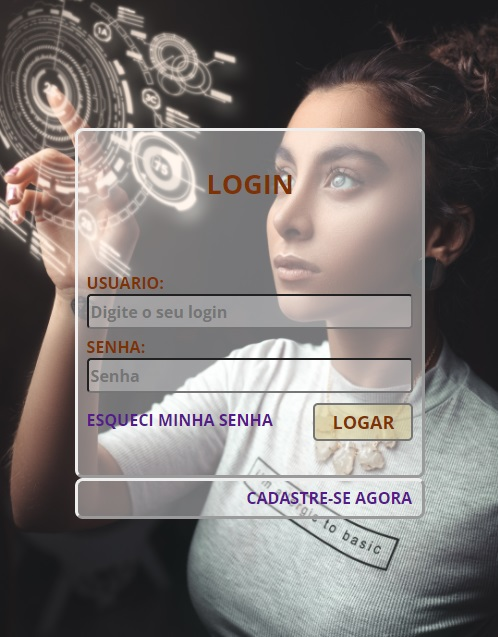
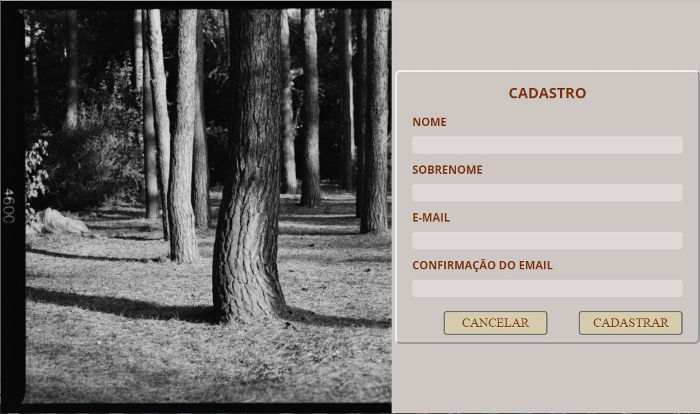

<h1> Sistema Web Manutenção</h1>

> *Mesma sistemática do sistema criado anteriormente com a técnologia Java Swing*

### Link > https://github.com/milinfic/manutencao

## Objetivos do projeto
- Implementar o back end usando Java Spring Boot
- Acesso a banco de dados PostgreSQL
- Estruturar o back end no padrão camadas
- Criar endpoints da API REST
- Estrutura Front-End com React.JS
- Implantação na nuvem

# Primeira Tela Front-End

  

# Tela Cadastrar

  

